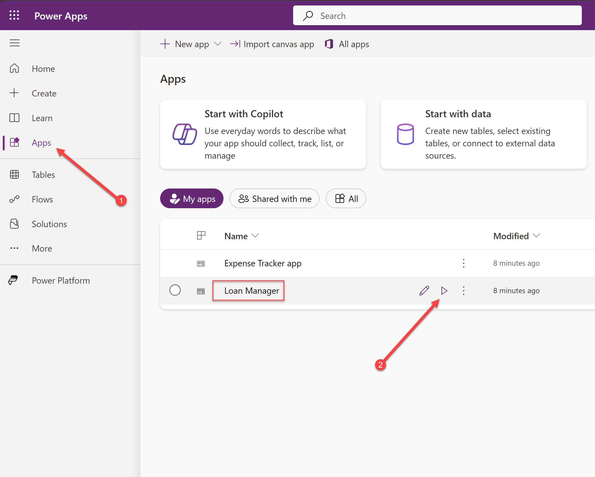
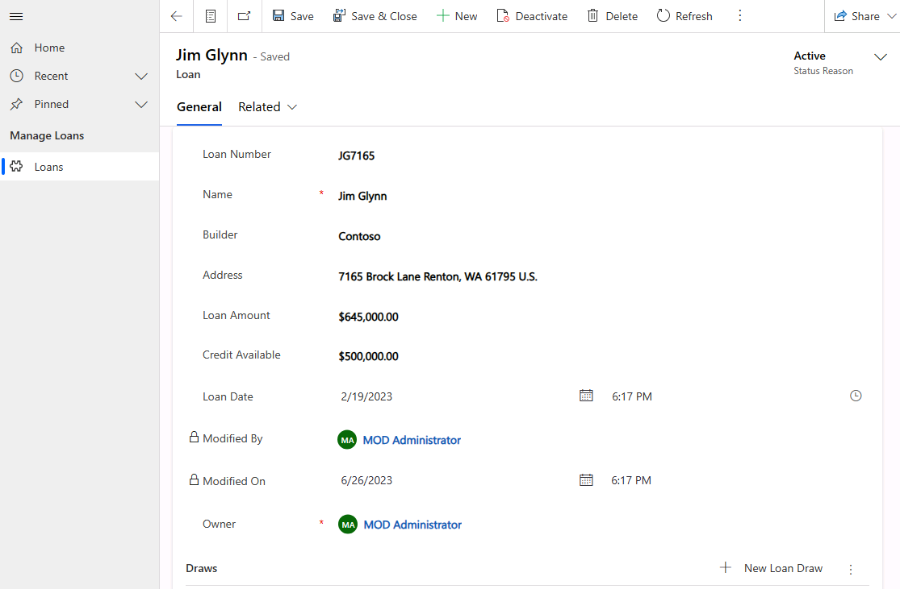

---
lab:
    title: 'Lab 11: Designing the Solution'
    module: 'Designing the Solution'
---

# Practice Lab 11 – Designing the Solution

**⏱️ The estimated time to complete this lab is 2 hours.**

## Scenario

In this lab, you will be working to design the automation of a Construction Loan
Funding process that is currently manually tracked by Relecloud staff.

## High-level lab objectives

-   Discover the current process

-   Evaluate automation options

-   Design the automation of the process

-   Import and review the starter solution

## Exercise \# 1 – Discover Current Process

In this exercise you are going to get to know the current manual process.

### Task 1: Review the process scenario

The following companies or people are involved in the process you will be
automating.

| **Company or people** | **Description**                                                                                                                             |
|-----------------------|---------------------------------------------------------------------------------------------------------------------------------------------|
| Borrower              | Borrows money from bank to build a house.                                                                                                   |
| Builder               | Has an agreement to build a house for the Borrower and gets paid as the house is built by Loan Draws from the borrower’s loan.                    |
| Woodgrove Bank        | Loans borrower money to build house, hires Relecloud to manage the construction loan draw funding as the house is built by the builder.     |
| Relecloud             | Escrow company that manages the process for the bank. They do all the manual work today and this is who you are automating the process for. |
| Fabrikam Inspections  | An inspection company that goes on site to verify and provide proof of work completed.                                                      |
| A Datum               | A risk management company that helps banks reduce losses from bad loans. They provide a risk score used in the process.                     |

The following describes the current manual process:

- Woodgrove Bank does construction loans to builders to build homes. Woodgrove
does not give all the loan money to the builders on initial approval; they only
give it as construction progresses. Each month, builders can request loan funds
(a draw) for the progress made and funds spent during the last month.
- Woodgrove is too busy to manage the process, so they hired Relecloud to manage
it. Each month builders email forms requesting funds to Relecloud. After review,
Relecloud requests Fabrikam Inspections via their website to do an onsite
inspection to verify the work stated was actually done.
- Once the inspection is completed, Relecloud does a risk check using a website A
Datum has that confirms that the builder hasn’t become high risk. After these
checks, Relecloud uses a Windows form app provided by Woodgrove to request
funding. Someone from Relecloud checks the app each day for any completed
requests and then they notify of funding completed.

Today Relecloud does each process step manually. You have been asked if you can
improve the process by automating some of the steps.

### Task 2: Review the draw request form

1.  Go to the lab resources folder and open the **Draw1-MC3747.pdf** file.

2.  Review the form.

3.  This form is completed for each draw by the builder and emailed to Relecloud.

### Task 3: Review the loan tracking Excel file

1.  Go to the lab resources folder and open the **LoanTracking-MC3747.xlsx** file.

2.  Review the loan tracking file.

3.  Relecloud staff creates one of these worksheet files for each loan and uses it to track the draws on the loan.

## Exercise \# 2 – Evaluate Automation Options

When you automate a process, you want to use the most efficient and reliable
means of automation possible. In this exercise you will re-review what you know
about the process, to determine what we require an application for and what we could use an API for to build out our automation.

### Task 1: Review and make notes of what should use an app and what should be a connector

A discovery process has been completed by the project team. The following is the
original scenario with our notes from the discovery added _in italics_.

Woodgrove Bank does construction loans to builders to build homes. Woodgrove
does not give all the loan money to the builders on initial approval; they only
give it as construction progresses. Each month, builders can request loan funds
(a draw) for the progress made and funds spent during the last month.

Woodgrove is too busy to manage the process, so they hired Relecloud to manage
it. Each month builders email forms requesting funds to Relecloud. After review,
Relecloud requests Fabrikam Inspections via their website to do an onsite
inspection to verify the work stated was actually done. *During discovery we
learned that Fabrikam has no plans to offer an API*.

Once the inspection is completed, Relecloud does a risk check using a website A
Datum has that confirm that the builder hasn’t become high risk. *During
discovery we learned A Datum has a RESTful API for the risk check*.

After these checks, Relecloud uses a Windows form app provided by Woodgrove to
request funding. Someone from Relecloud checks the app each day for any
completed requests and then they notify of funding completed. *During discovery
we learned that Woodgrove plans to modernize the app in the future*.

Today Relecloud does each process step manually. You have been asked if you can
improve the process by automating some of the process.

## Exercise \# 3 – Design the automation

In this exercise, you will review the design the team came up with. In the rest
of this course, you will be building out this automation.

### Task 1 – Review the process diagram

### Task 2 – Review design notes

-   A shared mailbox will be used to not be dependent on individual users.

-   Dataverse tables will be used instead of Excel worksheets to track the process. There will be a Loan, Loan Draw and Inspection Photo tables.

-   Child flows will be used for Lookup, Inspection and Funding to keep the main cloud flow maintainable.

-   The process involving the Inspection website will be automated with an unattended  desktop flow, which will include a JSON array of work site photos.

-   The inspection child flow will run the inspection desktop flow and then download and persist the work site photos to the Dataverse table.

-   A custom connector will be built for A Datum’s Risk API.

-   The Woodgrove Funding Manager Windows app will be automated with a desktop flow.

## Exercise \# 4 – Import starting solution

In this exercise, you will import a solution into your Dev environment, review
the components in the solution, run a cloud flow that will add test data to your
environment, and run the loan manager app included in the solution.

### Task 1: Import solution

1.  Navigate to https://make.powerapps.com and make sure you are in the **Dev** environment.

2.  Select **Solutions** and select **Import solution**.

3.  Select **Browse**.

4.  Select the **ConstructionFunding** solution file located in the lab resources folder and click **Open**.

5.  Select **Next**.

6.  Select **Next** again.

7.  Wait for the listed connection to sign in automatically and show a green check.

8.  Select **Import** and wait for the import to complete.

9.  You will get a notification when the import completes.

10.  Select **Publish all customizations** and wait for the publishing to complete.

11.  Do not navigate away from this page.

### Task 2: Review components

1.  Open the recently imported **Construction Funding** solution.

2.  The solution should have several components including 1 application, 1 cloud flow, 1 connection reference, 1 sitemap, and 3 tables.

3.  Expand **Tables**, expand the **Loan** table and select **Columns**.

4.  Review the columns for this **Loan** table.

5.  Expand the **Loan Draw** table and select **Columns**.

6.  Review the columns for this **Loan Draw** table.

7.  Select **Cloud flows** and open the **Create Test Data** cloud flow.

8.  Select **Edit**.

9.  Expand the **Parse JSON** step and review the data that will be added to your environment.

10.  Select the back button.

11.  Do not navigate away from this page.

### Task 3: Run flow

1.  Select **Cloud flows** and select **Details** to open the **Create Test Data** cloud flow.

2.  Select **Run**.

3.  Select **Run flow**.

4.  Select **Done**.

5.  **Wait** for the flow run to complete. You can select the refresh button until you see the success message.

### Task 4: Run loan manager app

1.  Navigate to https://make.powerapps.com and make sure you are in the **Dev**
    environment.

2.  Select **Apps** and launch the **Loan Manager** application by clicking on the **Play** button when you hover over the app name:

3.  You should see the data added by the cloud flow. Open one of the loan records.

4.  Review the loan.

