---
lab:
    title: 'Lab 16: Troubleshooting'
    module: 'Troubleshootingn'
---

**Troubleshooting**

**Scenario**

In this lab, you will learn how to monitor and debug desktop flows.

**High-level lab objectives**

-   Monitor desktop flows

-   Debug desktop flows

-   Add retry to desktop flow

**Exercise \#1: Monitor flows**

In this exercise, you will monitor desktop flows.

**Task \#1: Monitor desktop flows**

1.  Navigate to <https://make.powerautomate.com/> and make sure you are in your
    dev environment.

2.  Click on **More** and select **Discover all**.

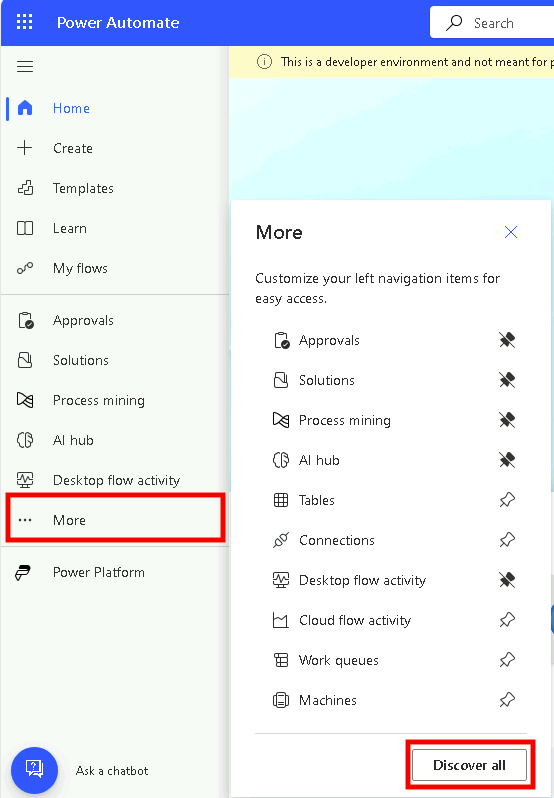

1.  Under **Monitor** select **Desktop flow runs**.

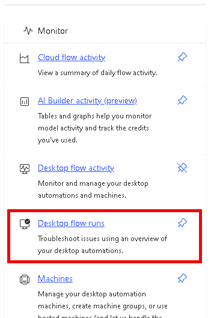

1.  If you don’t see anything, make sure you are in your Dev environment.

2.  Turn on **Auto refresh**.

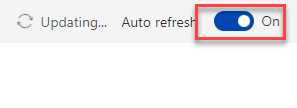

1.  Click on the ellipses of one the **Woodgrove Funding Manager Draw** run and
    select **See parent flow run**.

1.  You should see the parent cloud flow run (CF Manage Woodgrove Funding
    Process).

1.  Click on the browser back button.

2.  Click to open the **Woodgrove Funding Manager Draw** run.

1.  You should see all the actions in the flow run.

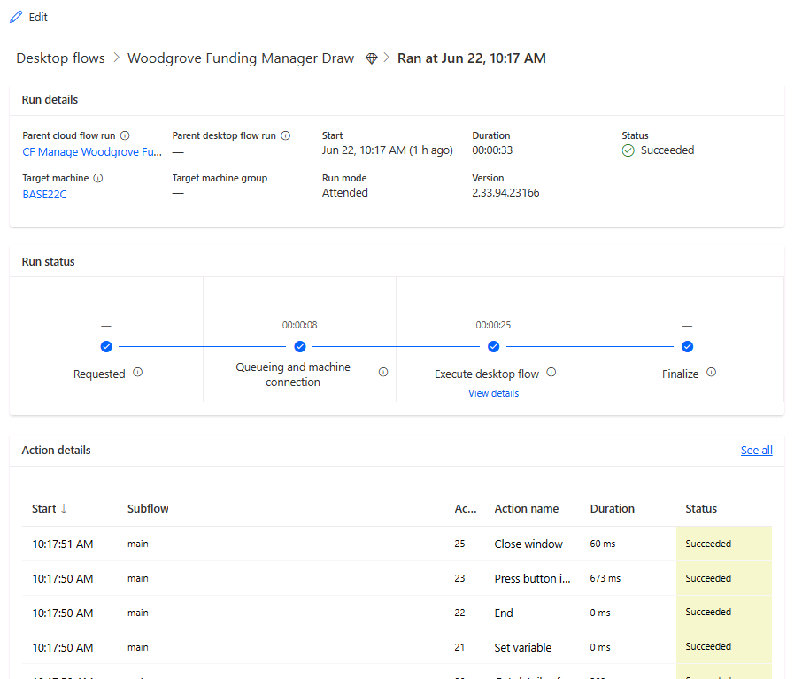

1.  Click on the start timestamp to open the **Set variable** action.

1.  Go to the **Action Details** pane and click **See output details**.

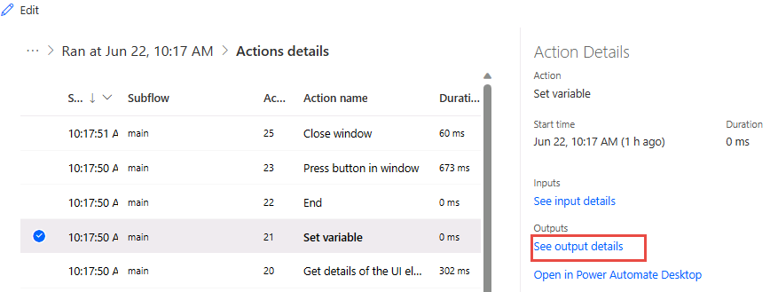

1.  You should see details of the variable.

1.  Close the **Outputs** pane.

2.  You may wish to review the other actions.

**Task \#2: Flow monitor**

1.  Launch **Power Automate for desktop**, make sure your dev environment is
    selected.

2.  Click **Settings**.

1.  Click on the **Monitoring/Notifications** dropdown, select **Flow monitoring
    window**, and click **Save**.

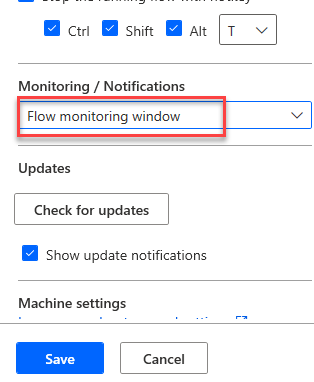

1.  Close the **Settings** pane.

2.  Run the **Perform Site Inspection**.

1.  Click **OK**.

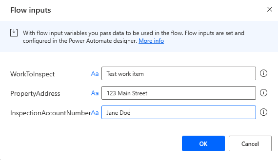

1.  Notice the monitor. Click **Pause**.

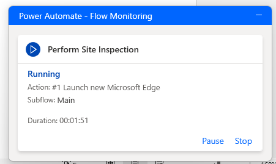

1.  The flow should pause. Click **Resume**.

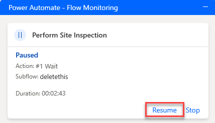

1.  Click **Stop**. The flow should stop, and the monitor should disappear.

**Exercise \#2: Debug flows**

**Task \#1: Debug flow**

1.  Go to Power Automate desktop flow and run the **Perform Site Inspection**
    flow again.

2.  Enter **456 Main Street** for Address and click **OK**.

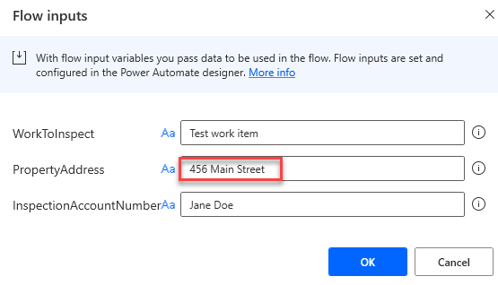

1.  Wait for the flow to finish running.

2.  The flow should fail, and you should see an error in the notification.

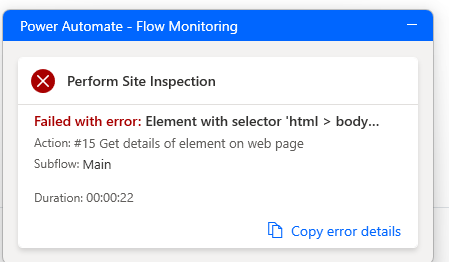

1.  Click **Edit** flow.

1.  Add a breakpoint on the first press button action. Clicking to the left of
    the line number will add a breakpoint.

1.  Edit the property address variable and change the default value to **456
    Main Street**.

2.  Click **Run**.

3.  The flow will pause when the breakpoint is hit. Click **Run next action**.

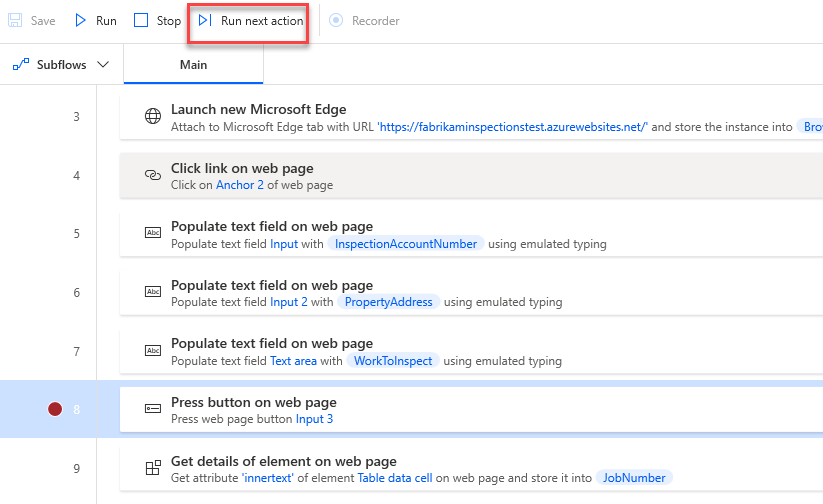

1.  The flow should advance to the next action and pause again. Click **Run next
    action** again.

2.  Click **Run next action** until the flow fails.

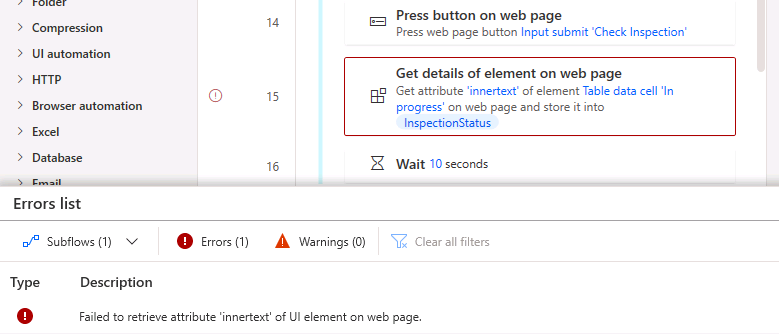

**Task \#2: Add retry**

1.  Click **Subflows** and select + New subflow.

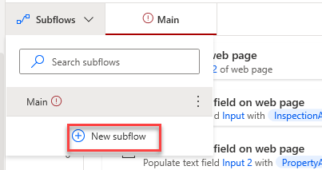

1.  Enter **WaitFlow** for name and click **Save**.

2.  Go to the **Actions** pane, search for **wait** and double click on the
    **Wait** action.

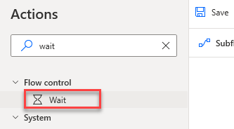

1.  Enter **60** and click **Save**.

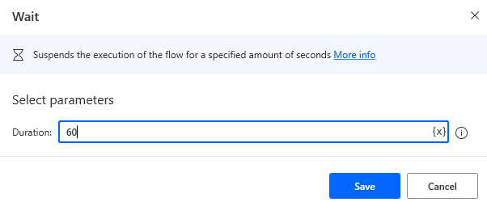

1.  The subflow should now have one wait action. Select the **Main** tab.

1.  Go to the **Actions** pane, search for **error**, drag **On block error**
    action, and place it after the **Get details of element on web page** for
    the **JobNumber** action.

1.  Enter **RetryOnError** for Name, click **+ New rule**, and select **Run
    subflow**.

1.  Select the **WaitFlow** you created and click **Continue flow run**.

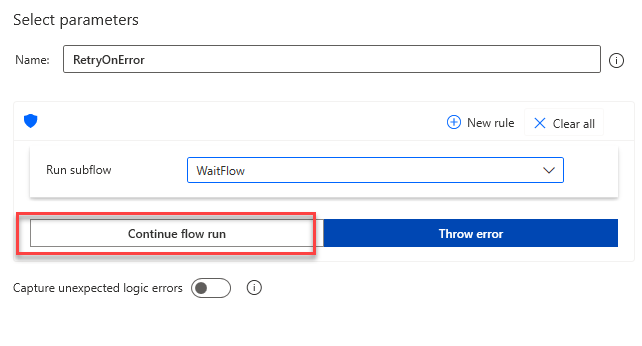

1.  Select **Go to beginning of block** for Exception handling mode and click
    **Save**.

1.  Click to select the action below the error block.

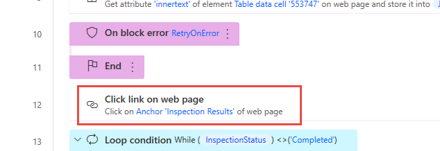

1.  Hold the **[SHIFT]** and click to select the **End** loop action.

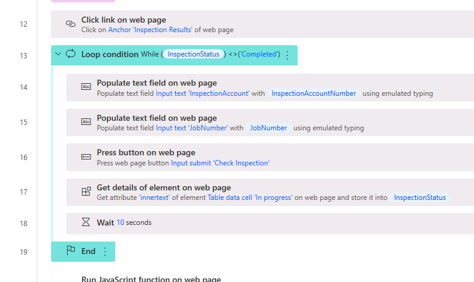

1.  Drag all the selected actions and drop them inside the error block.

2.  The **On block error** action should now look like the image below.

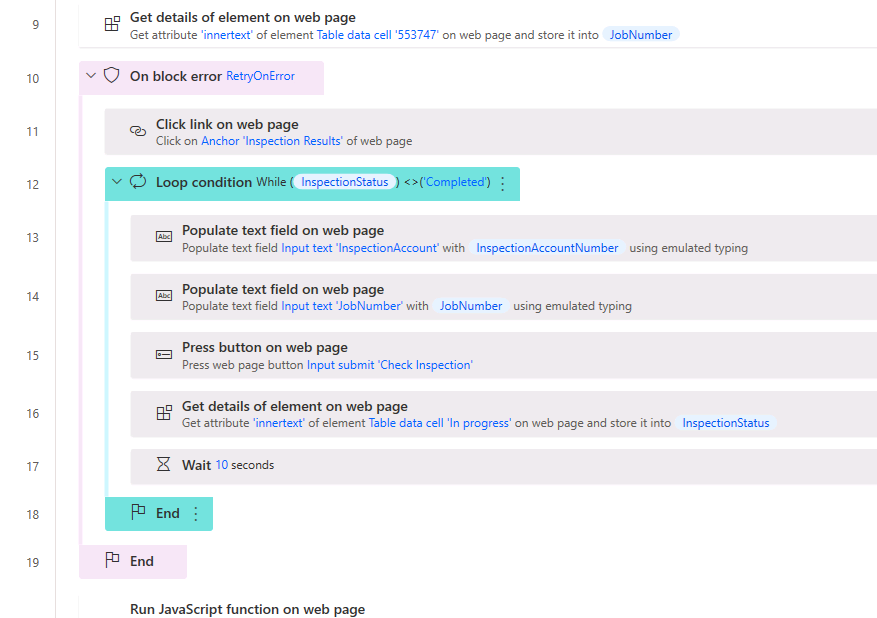

1.  Click **Save** and wait for the flow to be saved.

**Task \#3: Test**

1.  Remove the breakpoint and Click **Run**.

2.  The flow will switch to the subflow if error occurs.

1.  The flow will go back to the main flow after **60** seconds.

2.  The process should complete successfully.

